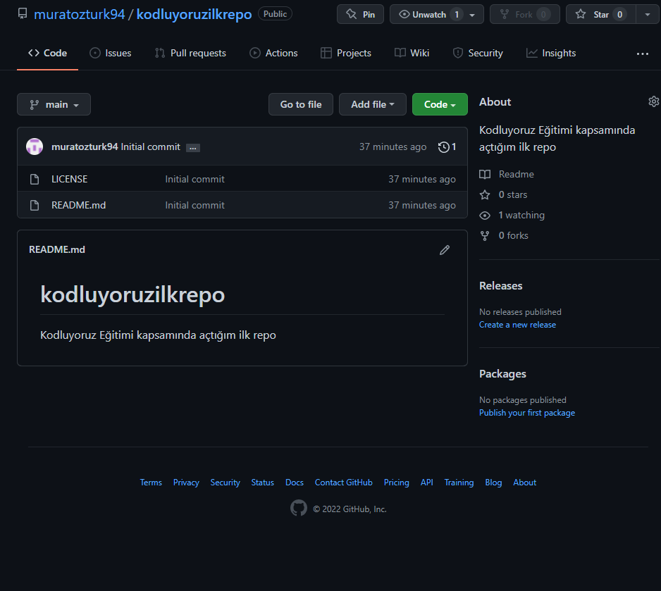

# Kodluyoruz Ilk Repo

### Bu repo [Kodluyoruz](https://www.kodluyoruz.org) Front-End Eğitiminde oluşturduğumuz ilk repo. İçerisinde bir addet README dosyası, bir adet de index.html barındırıyor.

 

## Installation
---
### Öncelikle projeyi clonelayın.

 

> git clone https://github.com/muratozturk94/kodluyoruzilkrepo.git

 

## Usage
---
### Projeyi cloneladıktan sonra Visual Studio Code programında açınız.
 

### Linux için:
> cd kodluyoruzilkrepo\
> code .

 

## Contributing
---

### Pull requestler kabul edilir. Büyük değişiklikler için, lütfen önce neyi değiştirmek istediğinizi tartışmak için bir konu açınız.

 

## License
---

[MIT](https://choosealicense.com/licenses/mit/)